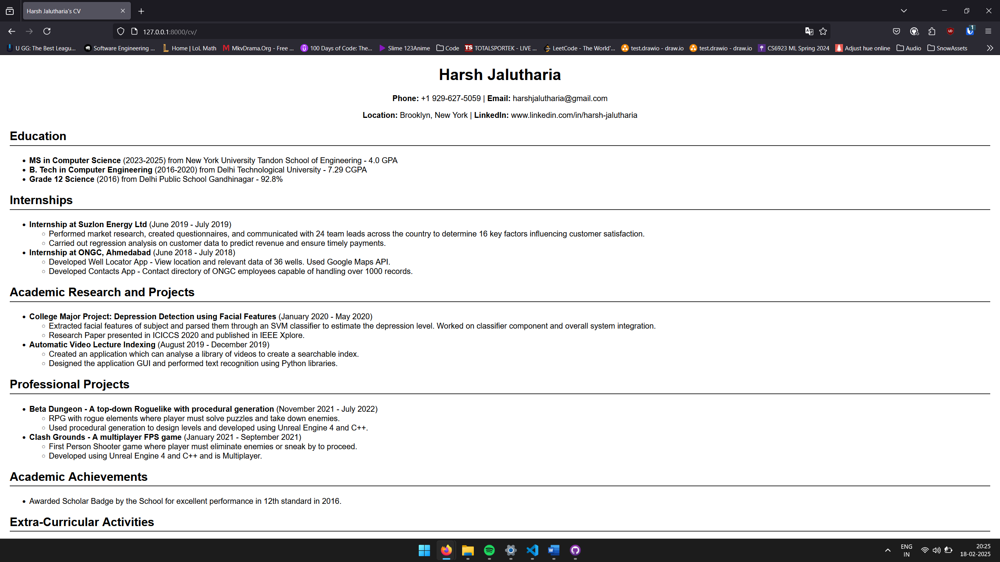

# CS-GY 6063 Software Engineering
## Sprint-1 Individual Assignment
### Made by: Harsh Jalutharia hj2607
This is the individual assignment for Sprint 1. The resume has been created using Django.

## Final Output

## How to run

1. Clone the repo and change working directory to repo using "cd".
2. Python version: 3.11.5, Django: 5.1.6. If you want to install Django, run: pip install -r requirements.txt
3. Run migrations: python manage.py migrate
4. Start the server: python manage.py runserver
5. Open the browser and paste this link: http://127.0.0.1:8000/cv/